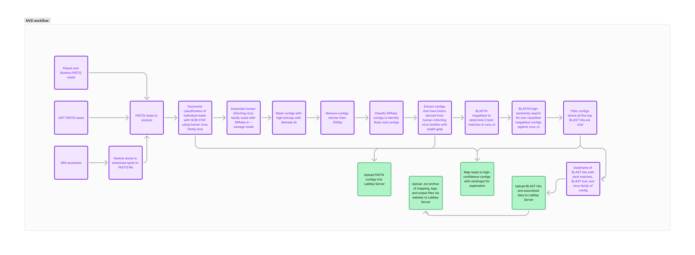

<!-- TABLE OF CONTENTS -->
<details>
  <summary>Table of Contents</summary>
  <ol>
    <li>
      <a href="#about-the-project">About The Project</a>
    </li>
    <li>
      <a href="#getting-started">Getting Started</a>
      <ul>
        <li><a href="#prerequisites">Prerequisites</a></li>
        <li><a href="#installation">Installation</a></li>
      </ul>
    </li>
    <li><a href="#usage">Usage</a></li>
    <li><a href="#roadmap">Roadmap</a></li>
    <li><a href="#contributing">Contributing</a></li>
    <li><a href="#license">License</a></li>
    <li><a href="#contact">Contact</a></li>
    <li><a href="#acknowledgments">Acknowledgments</a></li>
  </ol>
</details>

<!-- ABOUT THE PROJECT -->
## About NVD


NVD is an opinionated workflow for identifying and exploring metagenomes for families of viruses that infect humans. It is opinionated in that it focuses narrowly on these virus families to the exclusion of other potentially interesting viral and non-viral microbial taxa. NVD works with arbitrarily large Oxford Nanopore and Illumina datasets without downsampling. The results are available in a LabKey Server data explorer available to O'Connor lab users and collaborators. For those without LabKey data explorer access, results are stored locally.

### Why Another Metagenomic Workflow?

Good question. When I started working on NVD in June 2024, I hoped to find a widely used, easy-to-use workflow optimized for viral metagenomics. [CZID](https://czid.org) is excellent, but downsamples to a subset of reads. Sometimes this isn't a problem; sometimes it causes substantial reductions in sensitivity. The outstanding [Sourmash](https://github.com/sourmash-bio/sourmash) tools perform informative, efficient searches against reference databases but do not generate contigs that can be used to characterize interesting viruses.

### What Does NVD Do?

NVD begins with one or more Illumina paired-end or Oxford Nanopore datasets. It can also evaluate datasets downloaded from NCBI SRA. In the case of Illumina datasets, paired-end sequences are interleaved and properly paired using the bbmap `repair.sh` tool before processing.

These reads are the classified with the NCBI STAT tool, specifically the `aligns_to` command. A tax list containing the entire subtree of the virus families that infect humans is used for classification. This means that NVD is designed to find members of these virus families:

- Adenoviridae
- Anelloviridae
- Arenaviridae
- Arteriviridae 
- Astroviridae
- Bornaviridae
- Peribunyaviridae
- Caliciviridae
- Coronaviridae
- Filoviridae
- Flaviviridae
- Hepadnaviridae
- Hepeviridae
- Orthoherpesviridae
- Orthomyxoviridae
- Papillomaviridae
- Paramyxoviridae
- Parvoviridae
- Picobirnaviridae
- Picornaviridae
- Pneumoviridae
- Polyomaviridae
- Poxviridae
- Sedoreoviridae
- Retroviridae
- Rhabdoviridae
- Togaviridae
- Kolmioviridae

Reads that have kmers that match one or more viruses within these families are saved by `aligns_to.` These are "putative viral reads." NVD uses seqkit grep to extract these sequences from the original dataset.

The putative viral reads are then assembled into contigs with SPAdes. Empirically, the `--sewage` assembly preset provides the best results with both ONT and Illumina data, so this mode is used by NVD.

Contigs produced by SPAdes are then quality checked. Contigs with unusually high entropy, often consisting entirely of repetitive sequence, are filtered using `bbmask.sh.` Contigs shorter than 200bp after masking are removed, since short contigs are minimally informative. The filtered contigs are then classified with the NCBI STAT tool against a "coarse" reference library that is broadly representative of all the sequences in NCBI. A subtree of possible exact classifications is derived from the coarse classifications and used for more accurate classification. From these accurate classifications, contigs that appear to be viral are extracted.

These viral contigs are then used as BLAST queries against the NCBI `core-nt` database. Megablast classification typically identifies matches for most contigs. Those contigs that do not have megablast matches are then used as queries for blastn. 

Additionally, the putative viral reads are mapped against the viral contigs. This allows further exploration and confirmation of any unexpected or unusual hits.

The blast classifications, read mapping information, and associated contig metadata are then saved to an output folder in CSV format (and loaded into a database in the O'Connor lab LabKey Server, if appropriate access credentials are provided). `.zst` archives containing useful data files (e.g., read mapping `.bam` files) are also saved in the output folder.
  
<p align="right">(<a href="#readme-top">back to top</a>)</p>

<!-- GETTING STARTED -->
## Getting Started

NVD is written in Snakemake and has its dependencies bundled in an Apptainer container. NVD should work on machines with at least 32GB of available RAM. The `resources.zst` file is approximately 230GB. After decompression, it is approximately 300GB. The amount of storage needed depends on the size of the FASTQ files; 530GB plus 3x the size of the input FASTQ files is a good guide. For example, if the input FASTQ files are 100GB, ensure that at least 830GB of storage are available. Most testing has been done on Ubuntu Linux, however, a Dockerfile for replicating the Apptainer image is available for running on Macs running Docker Desktop.

### Prerequisites

- [Miniconda](https://docs.anaconda.com/miniconda/miniconda-install/)
- [Globus CLI](https://docs.globus.org/cli/)
- [Apptainer](https://apptainer.org/docs/admin/main/installation.html) (for Linux)
- [Docker Desktop](https://www.docker.com/products/docker-desktop/) (for MacOS)
- [Snakemake](https://snakemake.readthedocs.io/en/stable/)
- The `resources.zst` archive containing NCBI BLAST `core-nt`, NCBI STAT databases, a taxonomic rank database, and a taxonomic list of the subtree of human-infecting virus families.

The `resources.20240830.zst` version contains `core-nt` downloaded from NCBI on 2024-08-03, the STAT tree index downloaded 2024-08-30, the STAT tree filter.dbss and associated annotations downloaded 2024-08-30, `gettax.sqlite` downloaded on 2024-08-30, and a `human_viruses_taxlist.txt` created on 2024-09-05. 
- The `workflow` folder containing the Snakemake workflow and associated python scripts
- A `config` folder containing a `config.yaml` file specifying runtime variables and the samples to be analyzed. You also need to get the LabKey API Key, LabKey username, and LabKey password information from DHO for LabKey integration.

### Linux Installation

1. Clone the repo to the working directory and navigate into the working directory  
   ```sh
   git clone https://github.com/dhoconno/nvd.git && cd nvd
   ```
2. Create a conda environment with Apptainer and Snakemake 
	```
	conda create -n nvd
	conda activate nvd
	conda install -y snakemake apptainer -c conda-forge
	``` 
3. [Download](https://g-2e5b4e.dtn.globus.wisc.edu/nvd/nvd.30572.sif)) the Apptainer image file. If you have Globus access, this link is much, much faster than the `wget` access command shown below:.
   ```sh
   wget https://dholk.primate.wisc.edu/_webdav/dho/projects/lungfish/InfinitePath/public/%40files/nvd.30572.sif
   ```
4. [Download](https://g-2e5b4e.dtn.globus.wisc.edu/nvd/resources.20240830.zst) the `resources.zst` file containing databases and taxonomy files (note, this is ~230GB and will take a while to download. I suggest going out for an iced tea while you wait). If you have Globus access, this link is much, much faster than the `wget` access command shown below:
   ```sh
   wget https://dholk.primate.wisc.edu/_webdav/dho/projects/lungfish/InfinitePath/public/%40files/resources.20240830.zst
   ```
5. Decompress the `resources.zst` file in the working directory and remove source after decompression
   ```sh
   tar -I zstd -xvf resources.20240830.zst && rm resources.20240830.zst
   ```
6. Copy gzipped-FASTQ files to process into `data` folder within the working directory.
7. Modify the `config.yaml` file to specify the experiment number (an integer) and an output directory.
8. Modify the `config.yaml` file to specify the samples to process and the path(s) to their FASTQ files. Here are example entries for the three supported file types:
   **An important note on sample names -- replace all dashes (-) with underscores (_)**
   ```
   - name: Illumina_test
    r1_fastq: data/illumina.R1.fastq.gz
    r2_fastq: data/illumina.R2.fastq.gz
   - name: AE0000100A9532
    sra: SRR24010792
   - name: AE0000100A8B3C
    ont: data/AE0000100A8B3C.fastq.gz
   ```
   Many samples can be processed in the same workflow invokation. Multiple sample types can be processed at once. There is also a version of this workflow that runs one sample at a time on [CHTC](https://chtc.cs.wisc.edu) execute nodes. Ask DHO for details. 
   (note: if you have access to upload results to the LabKey data explorer, you will also need to add LabKey credentials to the `config.yaml` file. Ask DHO for details.)
10. Start an Apptainer shell in the working directory with the repo files
   ```
   apptainer shell nvd.30572.sif
   ```

After installation, there should be `data`, `config`, `resources`, and `workflow` folders in the working directory.

### MacOS installation

1. Download and install Docker Desktop. Provide at least 32GB of memory to Docker containers.
2. Clone the repo to the working directory and navigate into the working directory
   ```sh
   git clone https://github.com/dhoconno/nvd.git && cd nvd
   ```
3. Create a conda environment with Snakemake
	```
	conda create -n nvd
	conda activate nvd
	conda install -y snakemake -c conda-forge
	```
4. [Download](https://g-2e5b4e.dtn.globus.wisc.edu/nvd/nvd.30572.tar) the Docker image file. If you have Globus access, this link is much, much faster than the `wget` access command shown below:
   ```sh
   wget https://dholk.primate.wisc.edu/_webdav/dho/projects/lungfish/InfinitePath/public/%40files/nvd.30572.tar
   ```
5. Load the Docker image file
   ```sh
   docker load -i docker/nvd.tar
   ```
6. [Download](https://g-2e5b4e.dtn.globus.wisc.edu/nvd/resources.20240830.zst) the `resources.zst` file containing databases and taxonomy files (note, this is ~230GB and will take a while to download. I suggest going out for an iced tea while you wait). If you have Globus access, this link is much, much faster than the `wget` access command shown below:
   ```sh
   wget https://dholk.primate.wisc.edu/_webdav/dho/projects/lungfish/InfinitePath/public/%40files/resources.20240830.zst
   ```
7. Decompress the `resources.zst` file in the working directory and remove source after decompression
   ```sh
   tar -I zstd -xvf resources.20240830.zst && rm resources.20240830.zst
   ```
8. Copy gzipped-FASTQ files to process into `data` folder within the working directory.
9. Modify the `config.yaml` file to specify the samples to process and the path(s) to their FASTQ files. Here are example entries for the three supported file types:
   **An important note on sample names -- replace all dashes (-) with underscores (_)**
   ```
   - name: Illumina_test
    r1_fastq: data/illumina.R1.fastq.gz
    r2_fastq: data/illumina.R2.fastq.gz
   - name: AE0000100A9532
    sra: SRR24010792
   - name: AE0000100A8B3C
    ont: data/AE0000100A8B3C.fastq.gz
   ```
   Many samples can be processed in the same workflow invokation. Multiple sample types can be processed at once. There is also a version of this workflow that runs one sample at a time on [CHTC](https://chtc.cs.wisc.edu) execute nodes. Ask DHO for details. 
   (note: if you have access to upload results to the LabKey data explorer, you will also need to add LabKey credentials to the `config.yaml` file. Ask DHO for details.)
11. Start a Docker shell in the working directory with the repo files
   ```
   docker run -it --user $(id -u):$(id -g) -v $(pwd)/:/scratch -w /scratch nvd:30575
   ```

After installation, there should be `data`, `config`, `resources`, and `workflow` folders in the working directory.
<p align="right">(<a href="#readme-top">back to top</a>)</p>

<!-- USAGE EXAMPLES -->
## Usage

NVD is implemented as a snakemake workflow. It is designed to be run from within an Apptainer/Docker container as described above. There is one mandatory config parameter, `run_id` that must be specified upon invokation:

```sh
snakemake --cores XX --config run_id=`date +%s`
```
Note that `run_id` does not have to be a timestamp as shown in the example above, but it should be something that unambiguously differentiates different runs of the workflow.

The workflow should run to completion, with output saved to the location specified in `config.yaml['global']['out_dir']`. The output includes a CSV file describing the top five BLAST hits for each of the viral contigs. Be suspicious of hits with relatively high BLAST [evalues](https://blast.ncbi.nlm.nih.gov/doc/blast-help/FAQ.html) or those where only one or a few of the top hits are specific to a virus. There is also a `.zst` archive containing putative viral reads mapped against the de novo assembled contigs. The archive can be decompressed within the Apptainer/Docker container using:

```sh
unzstd [archive_name]
```

By default, all intermediate files are saved in case there is a problem with the workflow. After the workflow is run successfully, these files can be automatically removed with:

```sh
snakemake clean --cores XX --config run_id=`date +%s`
```

Use this carefully, since regenerating the `results` directory would require re-running the entire workflow.

<p align="right">(<a href="#readme-top">back to top</a>)</p>

<!-- ROADMAP -->
## Roadmap

- 2024-09-10 - first public release version
- I expect to update the databases approximately annually to incorporate newly discovered virus sequences

See the [open issues](https://github.com/dhoconno/nvd/issues) for a full list of proposed features (and known issues).

<p align="right">(<a href="#readme-top">back to top</a>)</p>

<!-- CONTRIBUTING -->
## Contributing

Contributions are what make the open source community such an amazing place to learn, inspire, and create. Any contributions you make are **greatly appreciated**.

If you have a suggestion that would make this better, please fork the repo and create a pull request. You can also simply open an issue with the tag "enhancement".
Don't forget to give the project a star! Thanks again!

1. Fork the Project
2. Create your Feature Branch (`git checkout -b feature/AmazingFeature`)
3. Commit your Changes (`git commit -m 'Add some AmazingFeature'`)
4. Push to the Branch (`git push origin feature/AmazingFeature`)
5. Open a Pull Request

<p align="right">(<a href="#readme-top">back to top</a>)</p>

### Top contributors:

<a href="https://github.com/dhoconno/nvd/graphs/contributors">
  
</a>

<!-- LICENSE -->
## License

See `LICENSE.txt` for more information.

<p align="right">(<a href="#readme-top">back to top</a>)</p>

<!-- CONTACT -->
## Contact

Dave O'Connor - [@dho](https://twitter.com/dho) - dhoconno@wisc.edu

Project Link: [https://github.com/dhoconno/nvd](https://github.com/dhoconno/nvd)

<p align="right">(<a href="#readme-top">back to top</a>)</p>

<!-- ACKNOWLEDGMENTS -->
## Acknowledgments

* [Marc Johnson](https://medicine.missouri.edu/faculty/marc-johnson-phd) and [Shelby O'Connor](https://slo.pathology.wisc.edu), my partners in innovative pathogen monitoring from environmental samples.
* Kenneth Katz, NCBI, for developing NCBI STAT, maintaining pre-built databases for STAT, and helpful discusssions
* [C. Titus Brown](https://www.vetmed.ucdavis.edu/faculty/c-titus-brown), for helpful discussions of using kmer classifiers as part of metagenomic workflows
* Development funded by [Inkfish](https://ink.fish)

<p align="right">(<a href="#readme-top">back to top</a>)</p>

<!-- MARKDOWN LINKS & IMAGES -->
<!-- https://www.markdownguide.org/basic-syntax/#reference-style-links -->
[contributors-shield]: https://img.shields.io/github/contributors/dhoconno/nvd.svg?style=for-the-badge
